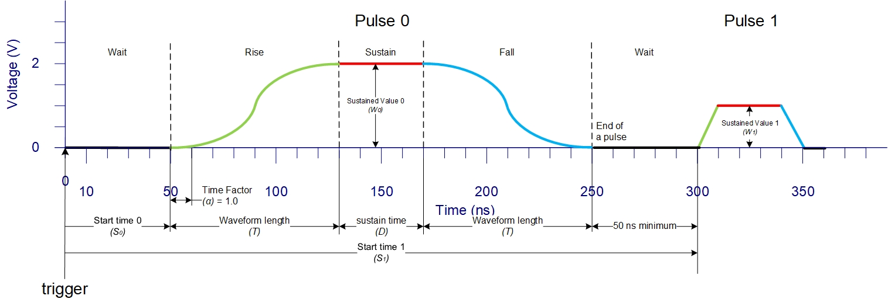
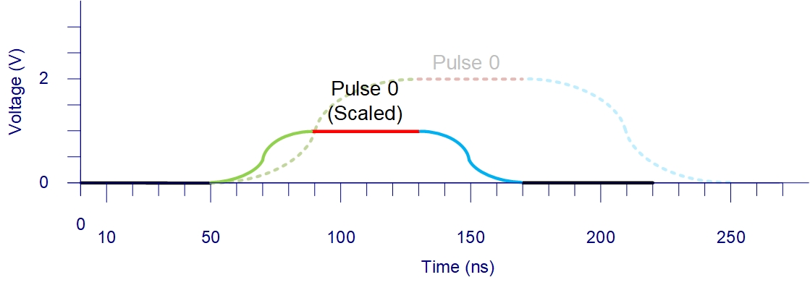

Background
==========

.. _background:

Trapped-ion systems are a leading platform for quantum computing due to their long coherence times and high-fidelity operations. Laser beams are essential for initializing, controlling, and measuring qubit states in these systems. However, traditional optical setups are bulky and power-intensive, limiting scalability.

`Photonic integrated circuits <https://arxiv.org/abs/2210.03100>`_ (PICs) address many of these issues. These miniaturized components reduce complexity, footprint, and optical losses while supporting fast modulation at nanosecond timescales. To take full advantage of PICs, control electronics must support high-resolution waveform generation and synchronized voltage outputs.

This project build a control system capable of generating precisely timed signals with 100 MHz resolution across 32 synchronized channels. Such timing precision is critical for implementing accurate and scalable quantum gates.

Hardware Platform
-----------------

The system is built around the `Xilinx Zynq UltraScale+ ZCU102 <https://docs.amd.com/v/u/en-US/ug1182-zcu102-eval-bd>`_ :term:`FPGA` board, which integrates:

- **Processing System (PS)**: Quad-core ARM Cortex-A53 CPU for software control and coordination.
- **Programmable Logic (PL)**: High-speed logic and Block :term:`RAM` for waveform generation and I/O control.
- **Interfaces**: :term:`PMOD` and :term:`FMC` connectors allow connection to both low- and high-speed :term:`DAC`.

This architecture allows parallel and deterministic signal control with low latency, suitable for trapped ion quantum experiments requiring sub-microsecond-level synchronization.

This Python interface abstracts the hardware, enabling researchers to design and test pulse sequences programmatically.

.. _pdef:

Pulse Sequences
---------------

Quantum operations often require shaped optical pulses. A typical :term:`pulse` consists of rise, sustain, and fall phases for stable and repeatable state transitions as in :numref:`pulse_seq`. The pulse is generated by sampling a user-defined :term:`waveform` data along with its :term:`pulse definition` every 10 ns.

.. _pulse_seq:

   An example of a pulse sequence with two pulses for two distinct waveforms.

For example, Pulse 0 from :numref:`pulse_seq`, with a waveform :math:`f_0(x)` (green line), can be generated using the equations in \autoref{tab:pulse_eqs} at various times and phases. Here, :math:`S` denotes the pulse :term:`start time`, :math:`T` is the :term:`wave length`, :math:`\alpha` is the :term:`time factor`, :math:`D` is the :term:`sustain` time, :math:`A` is the :term:`gain factor`, and :math:`W` is the output value during the sustain phase. Note that in :numref:`pulse_seq`, both the time and gain factors are set to 1.

.. _pulse_eqs:
.. list-table:: A single pulse's output at various time
   :name: tab_pulse_eqs
   :widths: auto
   :header-rows: 1

   * - **Time**
     - **Phase**
     - **Output**
   * - 0
     - Wait
     - 0
   * - ⋮
     - ⋮
     - ⋮
   * - :math:`S_0-1`
     - Wait
     - 0
   * - :math:`S_0`
     - Rise
     - :math:`A_0 f_0(0)`
   * - :math:`S_0+\alpha`
     - Rise
     - :math:`A_0 f_0\!\left(\dfrac{\alpha}{T_0}\right)`
   * - ⋮
     - ⋮
     - ⋮
   * - :math:`S_0+T_0`
     - Rise
     - :math:`A_0 f_0\!\left(\dfrac{T_0-1}{T_0}\right)`
   * - :math:`S_0+T_0+1`
     - Sustain
     - :math:`W_0`
   * - ⋮
     - ⋮
     - ⋮
   * - :math:`S_0+T_0+D_0`
     - Sustain
     - :math:`W_0`
   * - :math:`S_0+T_0+D_0+1`
     - Fall
     - :math:`A_0 f_0\!\left(\dfrac{T_0-1}{T_0}\right)`
   * - ⋮
     - ⋮
     - ⋮
   * - :math:`S_0+T_0+D_0+T_0`
     - Fall
     - :math:`A_0 f_0(0)`
   * - :math:`S_0+T_0+D_0+T_0+1`
     - Wait
     - 0

:math:`S` must be at least 50ns apart. That is, the start time of the next pulse shuold be:

.. math::
    t_{\text{next pulse start time}} \geq t_\text{current pulse start time} + 2*\lceil(\frac{t_\text{current pulse length}}{t_\text{current pulse time factor}})\rceil + t_\text{current pulse sustain} + 50ns

However, let's say pulse 0 in :numref:`pulse_seq` has a gain factor of 0.5, and time factor of 2, then pulse 0 will looks like something in :numref:`pulse_scaled`. The pulse will be scaled by the gain factor and time factor, which means the output value will be multiplied by the gain factor, and the time will be stepped by the time factor (instead of 1). 

.. _pulse_scaled:

   Scaled pulse 0 with gain factor of 0.5 and time factor of 2. With original in dotted line for comparison.