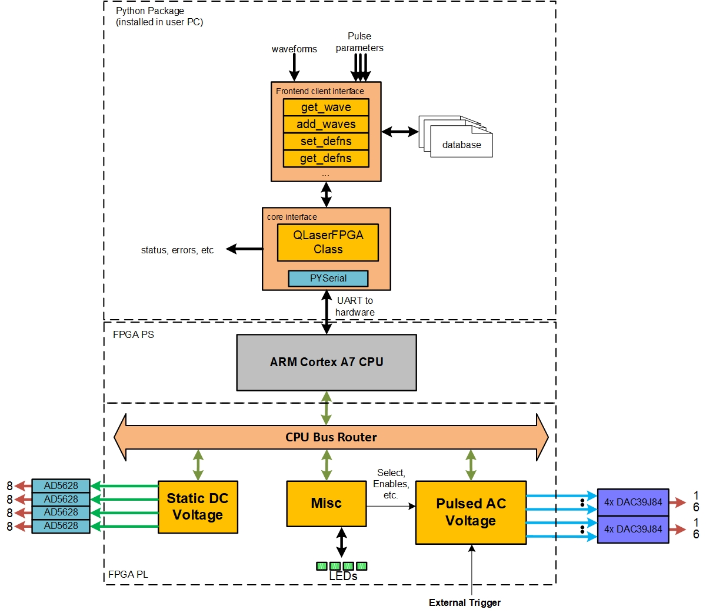
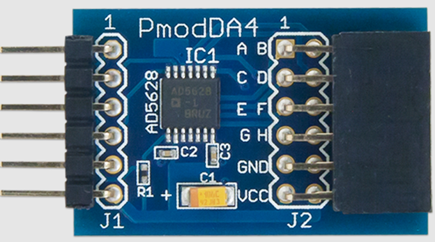

.. _hw_arch:

Hardware Architecture
----------------------
This package is designed for an FPGA system designed to generate 32 pulsed AC voltage signals and 32 static voltage signals. This system leverages both the processing systems and the programmable logic of the ZCU102 architecture. The Python-based interface allows users to input specific information about the pulses and voltage signals. This interface translates user requests into custom commands, which are then sent to the processing system via the FPGA's :term:`UART` interface.

The processing system's ARM-based CPU converts Python-generated commands into addressable :term:`instructions` for the FPGA's blocks. Within the FPGA hardware, a router takes the :term:`byte`-addressable data from the processing system and translates it into block-specific :term:`word`-addressable data. The system comprises three distinct hardware blocks, each serving a unique and critical function. The orange blocks in :numref:`sys_diagram` illustrate the names of these blocks, which will be discussed in detail in the subsequent sections.

.. _sys_diagram:

    FPGA system architecture block diagram.

DC Channel
----------------------

As illustrated in the :numref:`overview_diagram`, the hardware has the capability to generate 32 static "DC" and 32 pulsed "AC" voltage. The DC voltage is outputted from four AD5268 DACs, with each capable of generating 8 channels (labled letter A-H shown in :numref:`pmod_top`). Note the value of this function is a raw value between 0 and 4095 for the DAC, and voltage depending on the DAC's reference voltage. Refer to page 22 of the DAC's `documentation <https://www.analog.com/media/en/technical-documentation/data-sheets/AD5628_5648_5668.pdf>`_ for detailed information. This value could be so set and sent to the DAC using :meth:`~qlaser_zcu.genwave.vdac_to_hex` function, where a voltage value is converted to a raw value.

.. _pmod_top:

    Top view of one PMOD DAC, with lables A-H.

AC Channel
----------------------

The pulse generation module—also known as the **AC block**—is a high-precision, synchronous waveform generator designed for laser control in photonic quantum experiments. It supports 32 digital output channels with 10-nanosecond resolution, allowing for tightly controlled pulse sequences.

Each channel operates in perfect synchronization, a critical feature for ensuring temporal alignment in high-speed digital-to-analog conversion. This synchronization enables accurate reconstruction of analog signals required for fast and reliable modulation on photonic integrated chips.

The output of the waveform values are positive integers. The waveform is generated by the FPGA and sent to the DAC to generate a set of :ref:`pulse sequences <pdef>`.

Software Control Interface
--------------------------

Thie packages is the high-level abstraction interface that translates user-defined waveform data and pulse parameters into hardware-compatible formats. This layer allows researchers to focus on designing and refining quantum control strategies, without needing in-depth knowledge of low-level hardware communication.

The interface functions like a lightweight API, capable of handling memory allocation and waveform registration. For each waveform, it determines the next available memory space, calculates the starting address and length, and assigns a unique waveform ID. Inputs that exceed memory constraints are flagged with informative errors, and all waveform data is logged to a structured record file for traceability.

Pulse parameter management is similarly automated. Each pulse is defined by a fixed group of four values—start time, time factor, gain factor, and sustain time—alongside the associated waveform ID. Using this ID, the interface retrieves the waveform's memory location and length, translating the entire entry into a format understood by the hardware. Pulse records are stored separately for clarity.

After translation, the control values are passed over UART to the hardware using the `pyserial` library. A custom Python class wraps this communication, ensuring reliable delivery and integration with precise hardware subroutines. The PS then interprets the commands and activates specific logic blocks, maintaining accurate synchronization across the FPGA system. Top half part of :numref:`sys_diagram` illustrates the structure of the software control interface, which is responsible for managing the communication between the user and the hardware.

