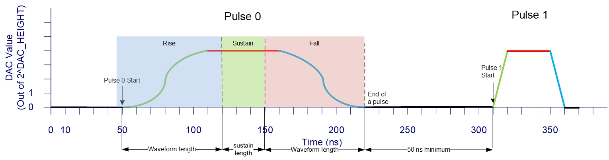

Core Hardware Components
========================

.. _hw_arch:

Hardware Architecture
----------------------
The hardware consists of the following parts. There is a interface that connects a PC running this package to the FPGA board running an appriprate hardware configuration file, or a :term:`bitstream`. Inside the FPGA contains a processing unit (PS) which convert the comment made by this package to a set of :term:`instructions` that is sent to the FPGA hardware (PL). The PL then generates the waveforms and sends them to the DAC. The DAC then converts the digital signals to analog signals and sends them to the laser control system. 

DC Channel
----------------------

As illustrated in the :numref:`overview_diagram`, the hardware has the capability to generate 32 static "DC" and 32 pulsed "AC" voltage. The DC voltage is outputted from four AD5268 DACs, with each capable of generating 8 channels (labled letter A-H shown in :numref:`pmod_top`). Note the value of this function is a raw value between 0 and 4095 for the DAC, and voltage depending on the DAC's reference voltage. Refer to page 22 of the DAC's `documentation <https://www.analog.com/media/en/technical-documentation/data-sheets/AD5628_5648_5668.pdf>`_ for detailed information. This value could be so set and sent to the DAC using :meth:`~qlaser_zcu.genwave.vdac_to_hex` function, where a voltage value is converted to a raw value.

.. _pmod_top:
.. figure:: _static/diagrams/pmod.png

    Top view of one PMOD DAC, with lables A-H.

AC Channel
----------------------

As discussed in :ref:`Hardware Architecture <hw_arch>`, there are up to 32 Pulse "AC" Channles in the hardware. Each channel can be configured to generate a waveform. The waveform is defined by a set of parameters, including the :term:`start time`, :term:`start address`, :term:`wave length`, :term:`gain factor`, :term:`time factor`, :term:`sustain`, and coefficients. The rise/fall of the waveform generated must be in the form:

.. math::
    p(x) = \sum_{i=0}^{n} a_i x^i

where :math:`a_i` are the coefficients.

The output of the waveform values are positive integers. The waveform is generated by the FPGA and sent to the DAC to generate the analog signal, as illustrated in the following diagram:

    Typical waveform generated by the FPGA.

Each waveform has three modes of operation: rise, sustain, and fall. Fall is the mirror of rise. In the image above, rise has been highlighted in blue, sustain in green, and fall in red.

The diagram shows two waveforms with arbirary polynomials generated by the FPGA. The first waveform has a start time of ~50 ns, with a length of 8 samples, with each sample being 10 ns. It has a sustain value of 3, and the gain factor and time factor are both 1. The second waveform has a length of 3 samples and a sustain value of 2. The minimum length of a waveform is 2 samples, and the maximum length is 4096 samples. The sustain value must be less than the length of the waveform. The gain factor and time factor must be positive integers. The start time is a positive integer, and it is the time when the waveform starts to rise. The start address is a positive integer, and it is the address in the waveform table RAM where the base value of the rise of the waveform is stored. The coefficients are a list of positive integers, and they are used to generate the polynomial function. The start times between pulses must be at least 50ns apart. That is, the start time of the next pulse shuold be:

.. math::
    t_{next pulse start time} \geq t_{current pulse start time} + 2*\lceil(\frac{t_{current pulse length}}{t_{current pulse time factor}})\rceil + t_{current pulse sustain} + 50ns

