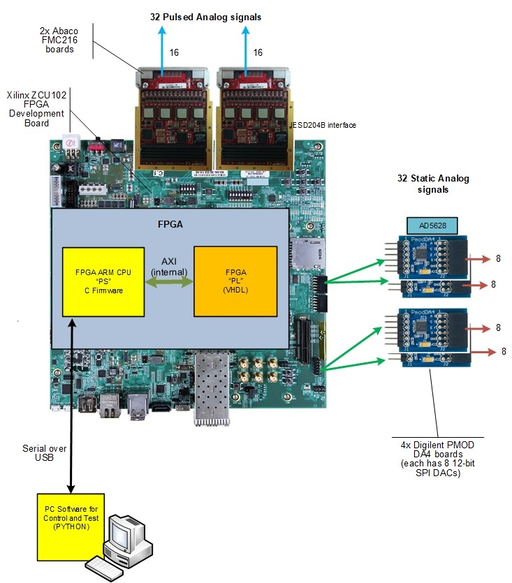

Introduction
=================

Purpose
---------------
Quantum computing is an advancing field that offers exponential speedups for problems that are difficult for classical computers to solve. One prominent platform for quantum computing utilizes trapped ions—charged atoms confined by electric fields and manipulated with lasers. Trapped ions provide high-fidelity quantum operations, long coherence times, and scalability potential. However, the complexity of the laser control system can be a bottleneck for the development of trapped-ion quantum computers. The hardware must generate multiple channels with precise timing and amplitude control to manipulate the ions. The control system must also be flexible to accommodate different experimental setups and be user-friendly to facilitate the development of new quantum algorithms. This project aims to simplify the control system by providing a user-friendly interface to the FPGA-based laser control system. 

Hardware overview
------------------
The hardware consists of an :term:`FPGA` board (Xilinx ZCU102) that generates the laser control signals. The FPGA board interfaces with external digital-to-analog converters (:term:`DAC`) that converts the :term:`digital` signals (1s and 0s) to :term:`analog` signals (any number between 0 to maximum voltage the DAC can generate). The analog signals are then sent to the laser control system to manipulate the trapped ions. The FPGA board has multiple :term:`channels` that can generate different waveforms and voltages to manipulate the ions. The user can configure the waveforms by defining various parameters. The FPGA generates the waveforms based on the user's configurations and sends the signals to the DAC. 

.. _hw_arch:

Hardware Architecture
----------------------
The hardware consists the follow parts. There is a interface that connects a PC running this package to the FPGA board running an appriprate hardware configuration file, or a :term:`bitstream`. Inside the FPGA contains a processing unit (PS) which convert the comment made by this package to a set of :term:`instructions` that is sent to the FPGA hardware (PL). The PL then generates the waveforms and sends them to the DAC. The DAC then converts the digital signals to analog signals and sends them to the laser control system. 

As mentioned from above image, the hardware has the capability to generate 32 static "DC" and 32 pulsed "AC" voltage. The DC voltage is outputted from four AD5268 DACs, with each capable of generating 8 channels (labled letter A-H). The DC channel can be set using :meth:`qlaser_zcu.qlaser_fpga.QlaserFPGA.write_dc_chan` function. Note the value of this function is a raw value between 0 and 4095 for the DAC, and depending on the DAC's reference voltage. Refer to page 22 of the DAC's `documentation <https://www.analog.com/media/en/technical-documentation/data-sheets/AD5628_5648_5668.pdf>`_ for detailed information. This value could be so set and sent to the DAC using :meth:`~qlaser_zcu.genwave.vdac_to_hex` function, where a voltage value is converted to a raw value.
