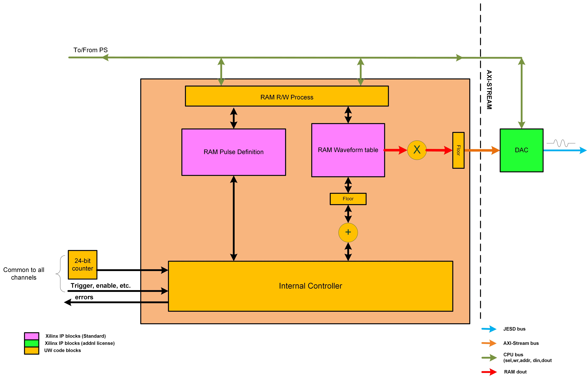
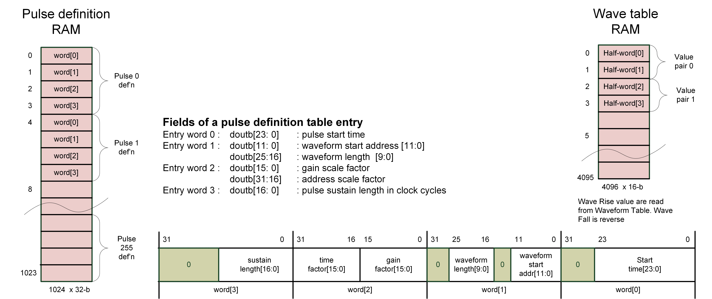

Pulse Channel
=================

As discussed in :ref:`Hardware Architecture <hw_arch>`, there are up to 32 Pulse "AC" Channles in the hardware. Each channel can be configured to generate a waveform. The waveform is defined by a set of parameters, including the :term:`start time`, :term:`start address`, :term:`wave length`, :term:`gain factor`, :term:`time factor`, :term:`sustain`, and coefficients. The waveform is generated by a polynomial function of the form:

.. math::
    p(x) = \sum_{i=0}^{n} a_i x^i

where :math:`a_i` are the coefficients.

The output of the waveform values are positive integers. The waveform is generated by the FPGA and sent to the DAC to generate the analog signal, as illustrated in the following diagram:

.. image:: _static/diagrams/waveform.jpg

Each waveform has three modes of operation: rise, sustain, and fall. Fall is the mirror of rise. In the image above, rise has been highlighted in blue, sustain in green, and fall in red.

The diagram shows two waveforms with arbirary polynomials generated by the FPGA. The first waveform has a start time of ~50 ns, with a length of 8 samples, with each sample being 10 ns. It has a sustain value of 3, and the gain factor and time factor are both 1. The second waveform has a length of 3 samples and a sustain value of 2. The minimum length of a waveform is 2 samples, and the maximum length is 4096 samples. The sustain value must be less than the length of the waveform. The gain factor and time factor must be positive integers. The start time is a positive integer, and it is the time when the waveform starts to rise. The start address is a positive integer, and it is the address in the waveform table RAM where the base value of the rise of the waveform is stored. The coefficients are a list of positive integers, and they are used to generate the polynomial function. The start times between pulses must be at least 50ns apart. That is, the start time of the next pulse shuold be:

.. math::
    t_{next pulse start time} \geq t_{current pulse start time} + 2*\lceil(\frac{t_{current pulse length}}{t_{current pulse time factor}})\rceil + t_{current pulse sustain} + 50ns

Hardware Overview
------------------
Each pulse channel consists two memory storages, or Block RAMS: a pulse definition RAM and a waveform table RAM, as illustrated in the following diagram:

The pulse definition RAM stores the parameters of the waveform. It can store up to 256 values, with each being 32-:term:`bit` integers, or a :term:`word`. However, the pulse channel reads the value in a group of 4 to a 128-bit integers. The waveform table RAM stores the base value of the rise of a pulse. It stores up to 4096 16-bit integers. Similar to the pulse definition RAM, the pulse channel reads the value in a pair of values to a word (or half-words). This design ensures each pulse must have minimum of 2 samples to from a waveform's rise and fall. Below shows the memory layout of the pulse definition RAM and waveform table RAM:

Each pulse's entry is accumulative in the pulse definition RAM.
